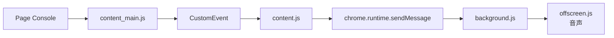
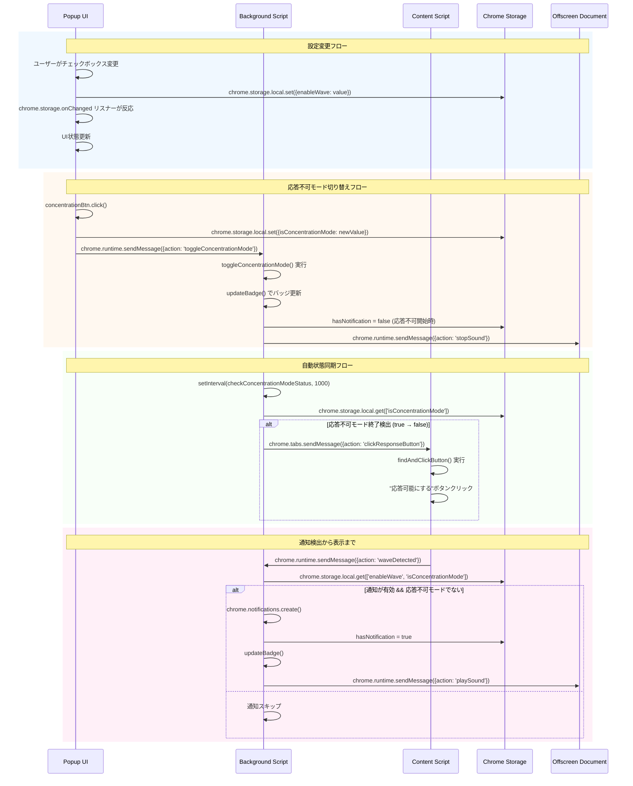

# Architecture

## 概要
gather.townでのwave、chat、call通知を検出してデスクトップ通知とサウンド再生を行うChrome拡張機能。応答不可モード（集中モード）機能と自動タブ管理機能を提供。

## コンポーネント構成

### Core Components
- **manifest.json** - 拡張機能の設定・権限定義
- **background.js** - メイン処理（通知管理・状態管理・UI制御）
- **content_main.js** - MAIN worldでconsoleログ監視
- **content.js** - ISOLATED worldでメッセージ中継・クリック検出
- **offscreen.js** - 音声再生処理
- **popup.js** - 設定メニュー表示・言語選択・カスタムi18n処理

### 実行環境
- **Service Worker** (background.js) - バックグラウンド処理
- **MAIN World** (content_main.js) - ページのconsoleを直接操作
- **ISOLATED World** (content.js) - Chrome APIアクセス
- **Offscreen Document** (offscreen.js) - 音声再生専用

## データフロー

### 通知検出フロー
1. gather.townページでconsole.log実行
2. content_main.js がログを傍受・検査
3. wave/chat/call関連ログ検出時にCustomEvent発火
4. content.js がイベント受信してbackground.jsに通知
5. background.js が通知表示・音声再生・バッジ更新

### 通知クリアフロー
- 拡張機能ボタンクリック → 設定メニュー表示・通知クリア・gather.townタブ移動/作成
- **デスクトップ通知クリック → background.js検出 → gather.townタブ活性化・通知クリア・音声停止**
- gather.townページ内クリック → content.js検出 → background.js通知クリア
- gather.townタブアクティブ化 → background.js検出 → 通知クリア・音声停止

### 応答不可モードフロー
1. ユーザーが応答不可ボタンクリック → background.js状態切替
2. background.js定期監視 → gather.town「応答可能にする」ボタン検出時に自動ON/OFF
3. 応答不可モード終了時 → content.jsに自動「応答可能にする」ボタン押下指示

### 言語選択フロー
1. ユーザーが言語ドロップダウン選択 → popup.js言語設定保存
2. popup.js → カスタムi18nリソース読み込み → UI動的更新
3. 設定保存 → chrome.storage.local → 次回起動時に復元

## 通信フロー



## ポップアップ-バックグラウンド間通信

### メッセージタイプ定義

```javascript
// ポップアップ → バックグラウンド
{
  action: 'toggleConcentrationMode',
  isConcentrationMode: boolean
}

{
  action: 'stopSound'
}

// コンテンツスクリプト → バックグラウンド  
{
  action: 'waveDetected',
  message: string,
  notificationType: 'wave'|'chat'|'call'
}

{
  action: 'clearNotificationOnClick'
}

// バックグラウンド → コンテンツスクリプト
{
  action: 'clickResponseButton'
}

{
  action: 'startConcentrationMode'
}

// バックグラウンド → オフスクリーン
{
  action: 'playSound',
  notificationType: 'wave'|'chat'|'call'
}

{
  action: 'stopSound'
}
```

### 通信フロー図

