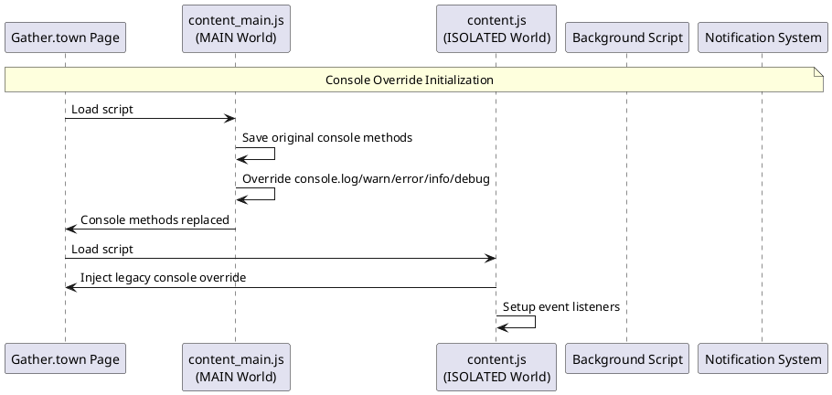
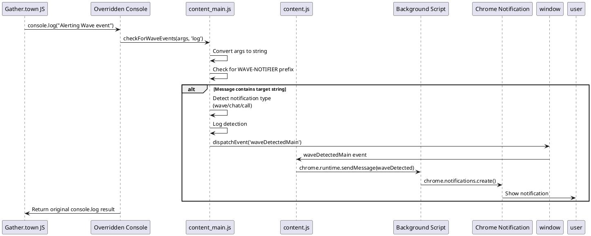
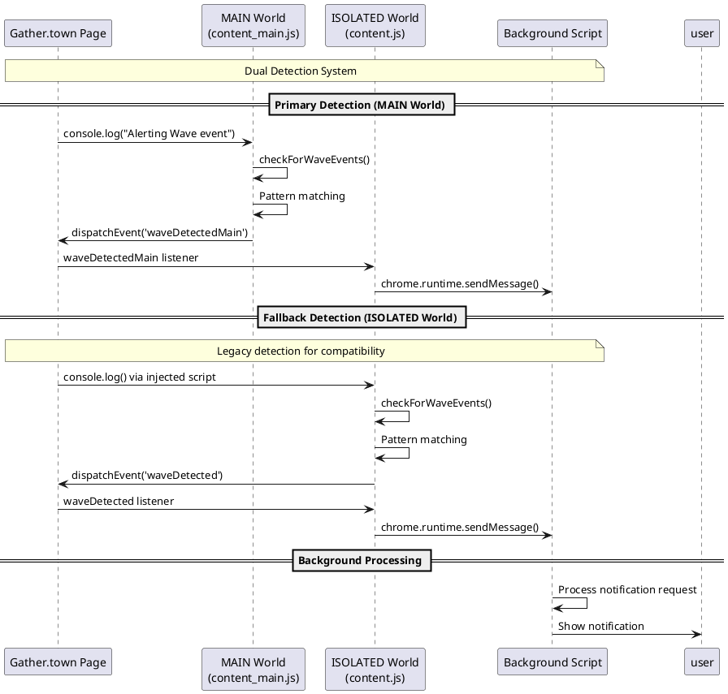
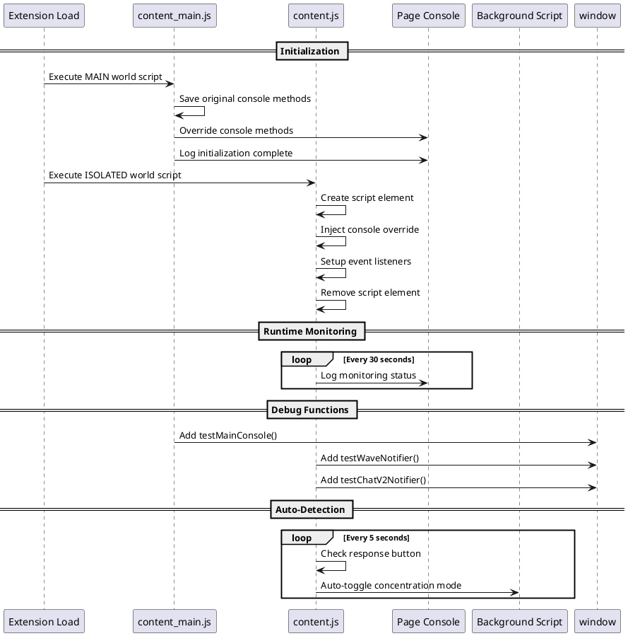
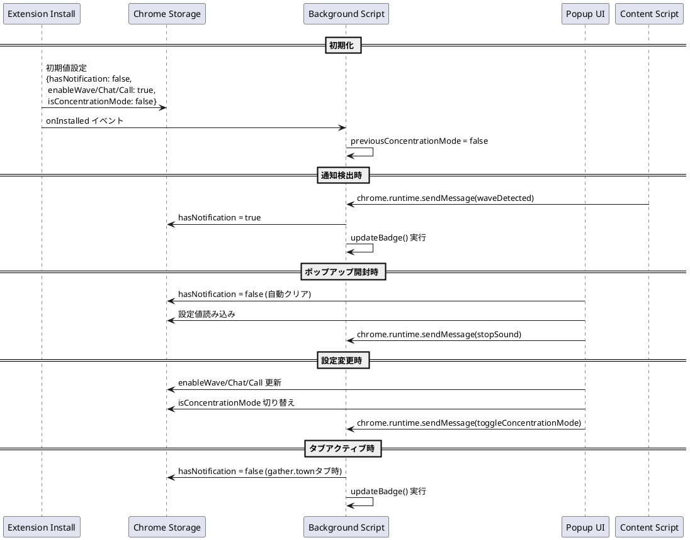
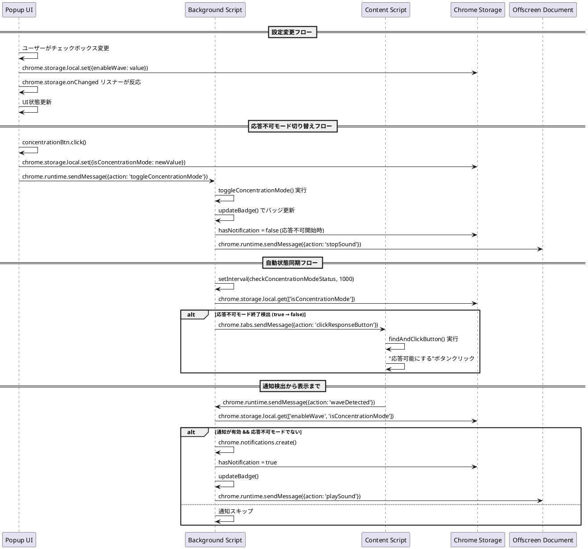
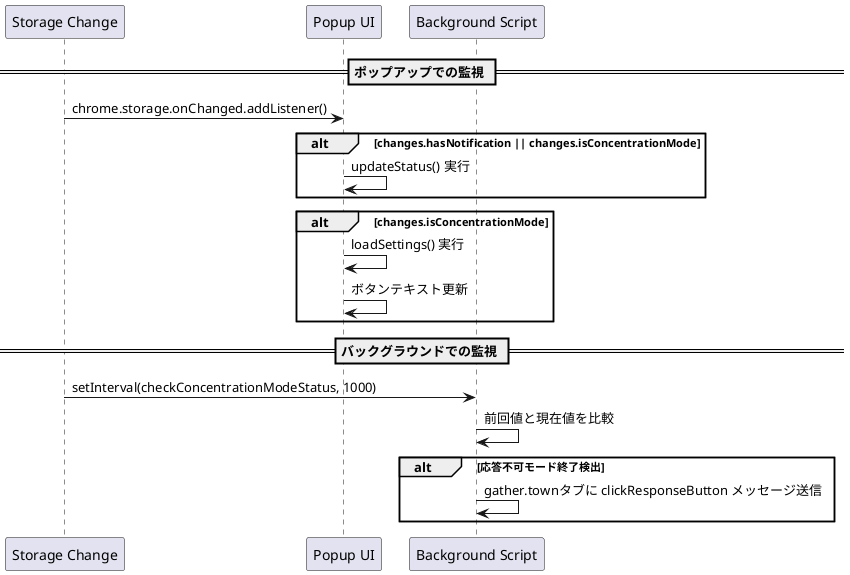

# 検出ロジック

## 検出対象
gather.townページのコンソールログで以下の文字列を検出：
- `Alerting Wave event` - Wave通知
- `Skipping ChatV2 notification` - Chat通知  
- `Alerting Ring event` - Call通知

## システム構成図



## 検出方法

### MAIN World Console Override
- `content_main.js`（MAIN world）でページの`console.log/warn/error/info/debug`をオーバーライド
- 元の関数を保存してから新しい関数で置き換え
- 無限ループ防止のため`[WAVE-NOTIFIER]`プレフィックスのメッセージを無視
- ページのJavaScriptと同じ実行環境でより確実にログを捕捉

### 二重検出システム
- `content.js`（ISOLATED world）でも従来方式の検出を継続
- `content_main.js`からのCustomEventを優先的に処理
- フォールバック機能として両方式を並行実行

## イベント検出フロー



## 二重検出システムの相互作用



## 状態管理とライフサイクル



### 実装詳細
```javascript
// 元の関数保存
const originalConsole = {
  log: console.log.bind(console),
  // ...
};

// オーバーライド
console.log = function(...args) {
  checkForWaveEvents(args, 'log');
  return originalConsole.log.apply(console, args);
};
```

## 通知トリガー
1. ログメッセージの文字列変換
2. 対象文字列の包含チェック
3. プレフィックスチェック（無限ループ防止）
4. 検出時CustomEvent発火

## デバッグ機能
- `testMainConsole()` - 手動テスト関数
- `[WAVE-NOTIFIER-MAIN] Intercepted` - 全ログ監視状況表示
- 30秒ごとの生存確認ログ

## 状態ストレージ管理

### Chrome Storage Local スキーマ

```javascript
{
  // 通知関連状態
  hasNotification: boolean,        // 未読通知の有無
  enableWave: boolean,            // Wave通知の有効性 (デフォルト: true)
  enableChat: boolean,            // Chat通知の有効性 (デフォルト: true)  
  enableCall: boolean,            // Call通知の有効性 (デフォルト: true)
  
  // 応答不可モード
  isConcentrationMode: boolean,   // 応答不可モードの状態 (デフォルト: false)
  
  // UI設定
  language: string               // UI言語設定 (デフォルト: 'auto')
}
```

### ストレージライフサイクル



## ポップアップ-バックグラウンド間通信

### メッセージタイプ定義

```javascript
// ポップアップ → バックグラウンド
{
  action: 'toggleConcentrationMode',
  isConcentrationMode: boolean
}

{
  action: 'stopSound'
}

// コンテンツスクリプト → バックグラウンド  
{
  action: 'waveDetected',
  message: string,
  notificationType: 'wave'|'chat'|'call'
}

{
  action: 'clearNotificationOnClick'
}

// バックグラウンド → コンテンツスクリプト
{
  action: 'clickResponseButton'
}

{
  action: 'startConcentrationMode'
}

// バックグラウンド → オフスクリーン
{
  action: 'playSound',
  notificationType: 'wave'|'chat'|'call'
}

{
  action: 'stopSound'
}
```

### 通信フロー図



### ストレージ変更監視

