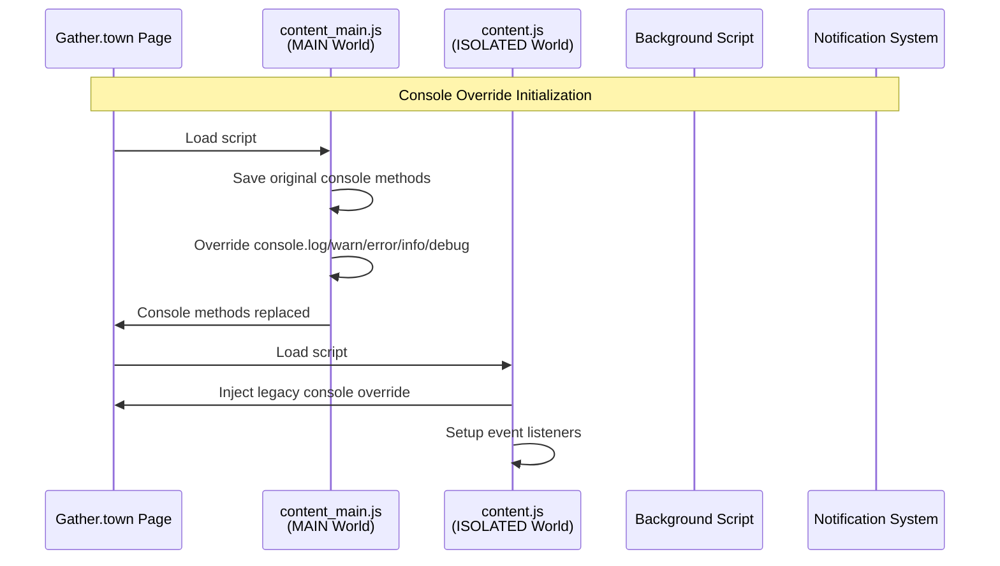
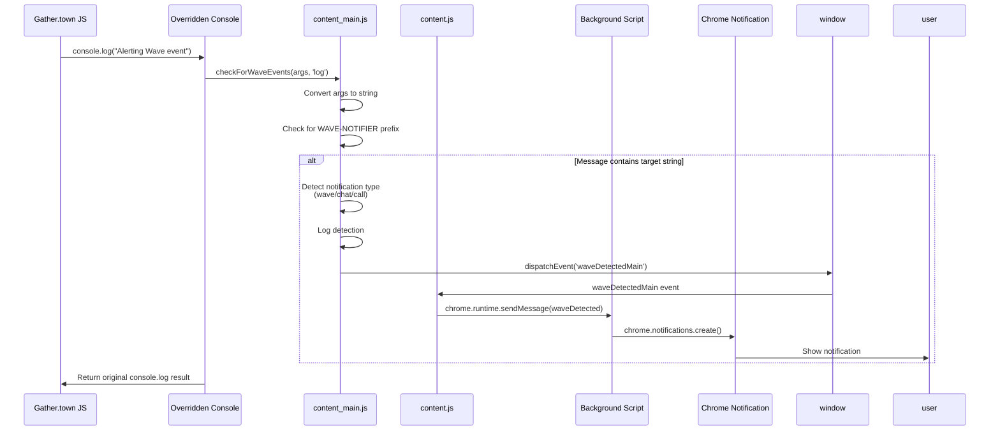
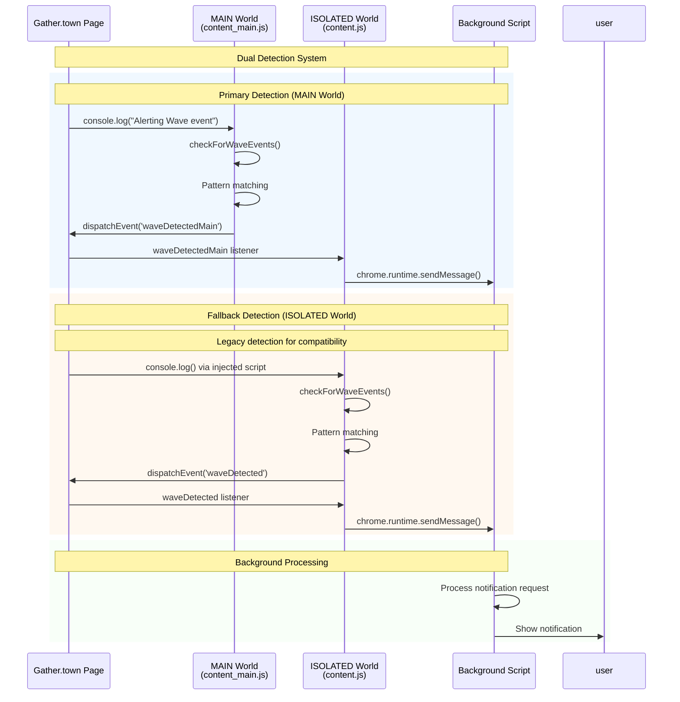
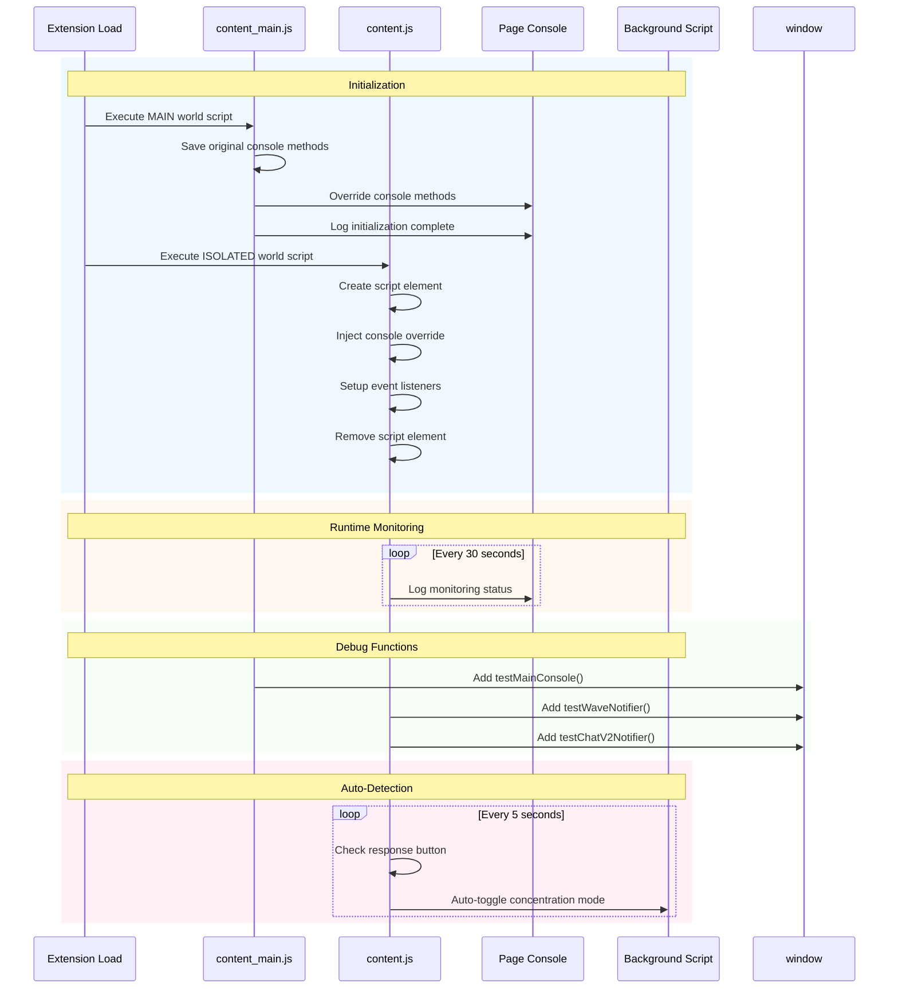

# 検出ロジック

## 検出対象

### Gather V1のメッセージパターン
gather.townページのコンソールログで以下の文字列を検出：
- `Alerting Wave event` - Wave通知
- `Skipping ChatV2 notification` - Chat通知
- `Alerting Ring event` - Call通知

### Gather V2のメッセージパターン
app.v2.gather.townページで以下の方法で検出（多言語対応）：

#### Wave通知（DOM検出、MutationObserver使用）
- 英語: `$name waved to you`
- ポルトガル語: `$name acenou para você`
- 日本語: `$nameさんが手を振りました`

#### Chat通知（DOM検出、MutationObserver使用）
- 英語: `$name sent a message`
- ポルトガル語: `$name enviou uma mensagem`
- 日本語: `$nameさんがメッセージを送信しました`

#### カレンダー通知（DOM検出、MutationObserver使用）
- 英語: `in $n minutes`
- ポルトガル語: `em $n minutos`
- 日本語: `$n 分後`

**注意事項**:
- V1とV2の両方のパターンを同時にサポートしているため、V1ユーザーもV2ユーザーも問題なく使用できます
- V2の検出はすべてDOM-based detection（MutationObserver）を使用し、コンソールログ方式は無効化されています
- Wave通知とChat通知では、ユーザー名を抽出して通知メッセージに含めます（例: "John waved to you!"）
- カレンダー通知は任意の分数（1分、5分、10分など）に対応しています
- V2は多言語対応（英語・ポルトガル語・日本語）

## システム構成図


```mermaid
sequenceDiagram
    participant page as Gather.town Page
    participant main as content_main.js<br/>(MAIN World)
    participant isolated as content.js<br/>(ISOLATED World)
    participant bg as Background Script
    participant notif as Notification System

    Note over page,notif: Console Override Initialization
    page->>main: Load script
    main->>main: Save original console methods
    main->>main: Override console.log/warn/error/info/debug
    main->>page: Console methods replaced

    page->>isolated: Load script
    isolated->>page: Inject legacy console override
    isolated->>isolated: Setup event listeners
```

## 検出方法

### MAIN World Console Override
- `content_main.js`（MAIN world）でページの`console.log/warn/error/info/debug`をオーバーライド
- 元の関数を保存してから新しい関数で置き換え
- 無限ループ防止のため`[WAVE-NOTIFIER]`プレフィックスのメッセージを無視
- ページのJavaScriptと同じ実行環境でより確実にログを捕捉

### 二重検出システム
- `content.js`（ISOLATED world）でも従来方式の検出を継続
- `content_main.js`からのCustomEventを優先的に処理
- フォールバック機能として両方式を並行実行

## イベント検出フロー


```mermaid
sequenceDiagram
    participant js as Gather.town JS
    participant console as Overridden Console
    participant main as content_main.js
    participant isolated as content.js
    participant bg as Background Script
    participant notif as Chrome Notification

    js->>console: console.log("Alerting Wave event")
    console->>main: checkForWaveEvents(args, 'log')
    main->>main: Convert args to string
    main->>main: Check for WAVE-NOTIFIER prefix
    alt Message contains target string
        main->>main: Detect notification type<br/>(wave/chat/call)
        main->>main: Log detection
        main->>window: dispatchEvent('waveDetectedMain')
        window->>isolated: waveDetectedMain event
        isolated->>bg: chrome.runtime.sendMessage(waveDetected)
        bg->>notif: chrome.notifications.create()
        notif->>user: Show notification
    end
    console->>js: Return original console.log result
```

## 二重検出システムの相互作用


```mermaid
sequenceDiagram
    participant page as Gather.town Page
    participant main as MAIN World<br/>(content_main.js)
    participant isolated as ISOLATED World<br/>(content.js)
    participant bg as Background Script

    Note over page,bg: Dual Detection System

    rect rgb(240, 248, 255)
        Note over page,bg: Primary Detection (MAIN World)
        page->>main: console.log("Alerting Wave event")
        main->>main: checkForWaveEvents()
        main->>main: Pattern matching
        main->>page: dispatchEvent('waveDetectedMain')
        page->>isolated: waveDetectedMain listener
        isolated->>bg: chrome.runtime.sendMessage()
    end

    rect rgb(255, 248, 240)
        Note over page,bg: Fallback Detection (ISOLATED World)
        Note over page,bg: Legacy detection for compatibility
        page->>isolated: console.log() via injected script
        isolated->>isolated: checkForWaveEvents()
        isolated->>isolated: Pattern matching
        isolated->>page: dispatchEvent('waveDetected')
        page->>isolated: waveDetected listener
        isolated->>bg: chrome.runtime.sendMessage()
    end

    rect rgb(248, 255, 248)
        Note over page,bg: Background Processing
        bg->>bg: Process notification request
        bg->>user: Show notification
    end
```

## 状態管理とライフサイクル


```mermaid
sequenceDiagram
    participant load as Extension Load
    participant main as content_main.js
    participant isolated as content.js
    participant console as Page Console
    participant bg as Background Script

    rect rgb(240, 248, 255)
        Note over load,bg: Initialization
        load->>main: Execute MAIN world script
        main->>main: Save original console methods
        main->>console: Override console methods
        main->>console: Log initialization complete

        load->>isolated: Execute ISOLATED world script
        isolated->>isolated: Create script element
        isolated->>isolated: Inject console override
        isolated->>isolated: Setup event listeners
        isolated->>isolated: Remove script element
    end

    rect rgb(255, 248, 240)
        Note over load,bg: Runtime Monitoring
        loop Every 30 seconds
            isolated->>console: Log monitoring status
        end
    end

    rect rgb(248, 255, 248)
        Note over load,bg: Debug Functions
        main->>window: Add testMainConsole()
        isolated->>window: Add testWaveNotifier()
        isolated->>window: Add testChatV2Notifier()
    end

    rect rgb(255, 240, 248)
        Note over load,bg: Auto-Detection
        loop Every 5 seconds
            isolated->>isolated: Check response button
            isolated->>bg: Auto-toggle concentration mode
        end
    end
```

### 実装詳細
```javascript
// 元の関数保存
const originalConsole = {
  log: console.log.bind(console),
  // ...
};

// オーバーライド
console.log = function(...args) {
  checkForWaveEvents(args, 'log');
  return originalConsole.log.apply(console, args);
};
```

## 通知トリガー
1. ログメッセージの文字列変換
2. 対象文字列の包含チェック
3. プレフィックスチェック（無限ループ防止）
4. 検出時CustomEvent発火

## デバッグ機能
- `testMainConsole()` - 手動テスト関数
- `[WAVE-NOTIFIER-MAIN] Intercepted` - 全ログ監視状況表示
- 30秒ごとの生存確認ログ

### DOM-based Detection
V2の通知はMutationObserverを使用してDOMの変更を監視：

#### Wave検出（多言語対応）
```javascript
// Wave detection - multi-language support
let waveMatch = null;
let userName = null;

// English: "$name waved to you"
if (textContent.includes(' waved to you')) {
  waveMatch = textContent.match(/(.+?)\s+waved to you/);
}
// Portuguese: "$name acenou para você"
else if (textContent.includes(' acenou para você')) {
  waveMatch = textContent.match(/(.+?)\s+acenou para você/);
}
// Japanese: "$nameさんが手を振りました"
else if (textContent.includes('さんが手を振りました')) {
  waveMatch = textContent.match(/(.+?)さんが手を振りました/);
}

if (waveMatch && waveMatch[1]) {
  userName = waveMatch[1].trim();
  chrome.runtime.sendMessage({
    action: 'waveDetected',
    notificationType: 'wave',
    userName: userName
  });
}
```

#### Chat検出（多言語対応）
```javascript
// Chat detection - multi-language support
let chatMatch = null;
let chatUserName = null;

// English: "$name sent a message"
if (textContent.includes(' sent a message')) {
  chatMatch = textContent.match(/(.+?)\s+sent a message/);
}
// Portuguese: "$name enviou uma mensagem"
else if (textContent.includes(' enviou uma mensagem')) {
  chatMatch = textContent.match(/(.+?)\s+enviou uma mensagem/);
}
// Japanese: "$nameさんがメッセージを送信しました"
else if (textContent.includes('さんがメッセージを送信しました')) {
  chatMatch = textContent.match(/(.+?)さんがメッセージを送信しました/);
}

if (chatMatch && chatMatch[1]) {
  chatUserName = chatMatch[1].trim();
  chrome.runtime.sendMessage({
    action: 'waveDetected',
    notificationType: 'chat',
    userName: chatUserName
  });
}
```

#### Calendar検出（多言語対応）
```javascript
// Calendar detection - multi-language support
let calendarMatch = null;

// English: "in $n minutes"
calendarMatch = textContent.match(/in (\d+) minutes?/);
// Portuguese: "em $n minutos"
if (!calendarMatch) {
  calendarMatch = textContent.match(/em (\d+) minutos?/);
}
// Japanese: "$n 分後"
if (!calendarMatch) {
  calendarMatch = textContent.match(/(\d+)\s*分後/);
}

if (calendarMatch) {
  chrome.runtime.sendMessage({
    action: 'waveDetected',
    notificationType: 'calendar'
  });
}
```

**特徴**:
- コンソールログより信頼性が高い
- リアルタイムなDOM変更検出
- ユーザー名を抽出して通知に含める（WaveとChat）
- 柔軟なパターンマッチング（カレンダーは任意の分数に対応）
- 多言語対応（英語・ポルトガル語・日本語）
- V1では従来のコンソール検出を継続使用

**初期化**:
```javascript
function setupDOMObserver() {
  const notificationObserver = new MutationObserver((mutations) => {
    // mutation handling...
  });

  // Wait for body to be available
  if (document.body) {
    notificationObserver.observe(document.body, {
      childList: true,
      subtree: true
    });
  } else {
    // Poll every 100ms until body is ready
    const checkBody = setInterval(() => {
      if (document.body) {
        clearInterval(checkBody);
        notificationObserver.observe(document.body, {
          childList: true,
          subtree: true
        });
      }
    }, 100);
  }
}
setupDOMObserver();
```

## V2 Concentration Mode Detection

V2の応答不可モード（集中モード）検出:

```javascript
// V1: "応答可能にする" button
const responseButton = Array.from(document.querySelectorAll('button')).find(button =>
  button.innerHTML.trim() === "応答可能にする" || button.textContent.trim() === "応答可能にする"
);

// V2: "Enter office" div (multi-language support)
const enterOfficeDiv = Array.from(document.querySelectorAll('div')).find(div => {
  const text = div.textContent.trim();
  return text === "Enter office" || text === "オフィスに入る" || text === "Entrar no escritório";
});

// 集中モード判定（V1またはV2のいずれかが存在する場合）
const shouldBeInConcentrationMode = !!(responseButton || enterOfficeDiv);
```

**集中モード終了時のボタンクリック**:
```javascript
// V1: "応答可能にする" ボタンをクリック
if (button.textContent.trim() === "応答可能にする") {
  button.click();
}

// V2: "Enter office" div (multi-language) をクリック
const text = div.textContent.trim();
if (text === "Enter office" || text === "オフィスに入る" || text === "Entrar no escritório") {
  div.click();
}
```

**特徴**:
- V1とV2の両方に対応した自動検出
- V2は多言語対応（英語・日本語・ポルトガル語）
- 5秒ごとにDOM監視して状態を同期
- 集中モード終了時に適切なボタン/divを自動クリック
- リトライロジック（最大3回、1秒間隔）

## 状態ストレージ管理

状態管理の詳細は [state-management.md](state-management.md) を参照してください。

## ポップアップ-バックグラウンド間通信

通信フローの詳細は [architecture.md](architecture.md) を参照してください。

