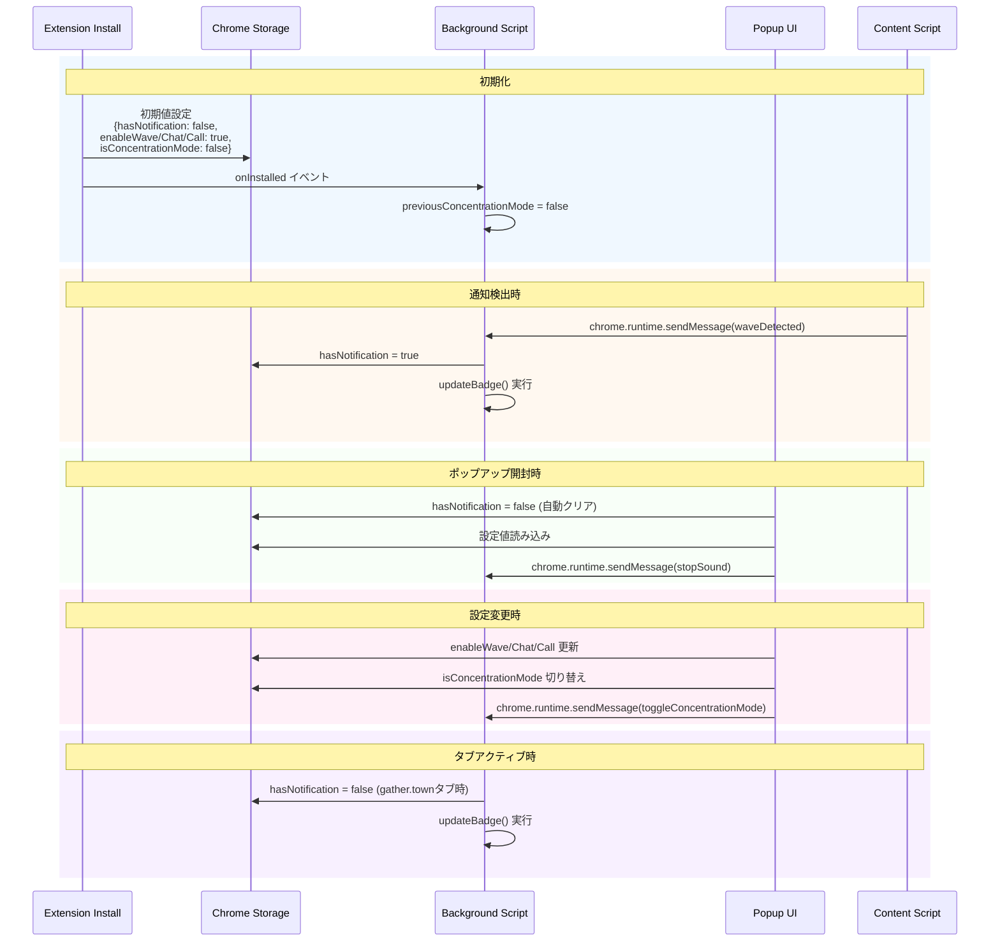
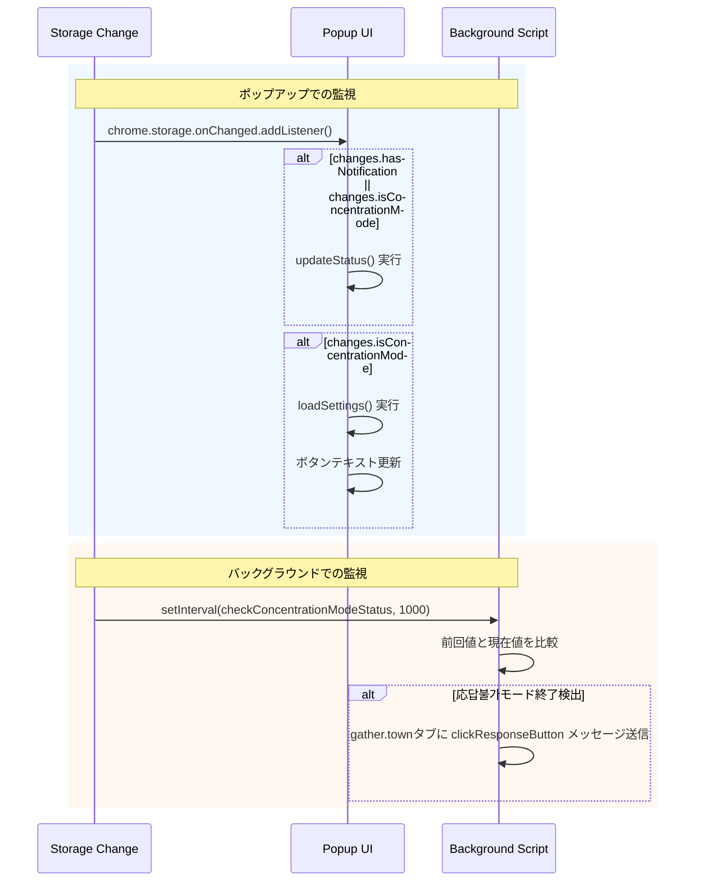

# 状態管理

## 通知状態
- **hasNotification** (boolean) - 未読通知の有無
- **offscreenCreated** (boolean) - offscreenドキュメント作成状態
- **isConcentrationMode** (boolean) - 応答不可モード状態
- **language** (string) - UI言語設定 ('auto', 'en', 'ja', 'de', 'fr')
- **notificationSettings** (object) - 通知種別設定
  - **wave** (boolean) - Wave通知の有効/無効
  - **chat** (boolean) - Chat通知の有効/無効  
  - **call** (boolean) - Call通知の有効/無効

## 状態保存
- `chrome.storage.local` - ブラウザ再起動後も状態保持
- メモリ変数 - 即座なアクセス用

## 状態遷移

### 通知発生時
1. `hasNotification = true`
2. バッジ表示 (`!` マーク、赤背景)
3. 音声再生開始
4. ローカルストレージに保存

### 通知クリア条件
- 拡張機能アイコンクリック（設定メニューと同時）
- gather.townページ内のクリック
- 応答不可モード時は通知自体が無効化

### 通知クリア時
1. `hasNotification = false`
2. バッジ非表示（応答不可モードバッジは保持）
3. 音声停止
4. ローカルストレージ更新

### 応答不可モード
- **開始時**: `isConcentrationMode = true`、バッジに「C」表示、gather.townタブ移動
- **終了時**: `isConcentrationMode = false`、応答不可モードバッジ削除
- **効果**: 全通知を無効化、音声再生なし

## タブ管理
- **gatherTabs** (Set) - gather.townタブのID一覧
- タブ更新時に自動追加
- タブ閉鎖時に自動削除
- アクティブタブ変更監視

## 初期化
- 拡張機能インストール時: すべて初期化
- ブラウザ起動時: ローカルストレージから復元

## Chrome Storage Local スキーマ

```javascript
{
  // 通知関連状態
  hasNotification: boolean,        // 未読通知の有無
  enableWave: boolean,            // Wave通知の有効性 (デフォルト: true)
  enableChat: boolean,            // Chat通知の有効性 (デフォルト: true)  
  enableCall: boolean,            // Call通知の有効性 (デフォルト: true)
  
  // 応答不可モード
  isConcentrationMode: boolean,   // 応答不可モードの状態 (デフォルト: false)
  
  // UI設定
  language: string               // UI言語設定 (デフォルト: 'auto')
}
```

## ストレージライフサイクル



## ストレージ変更監視

